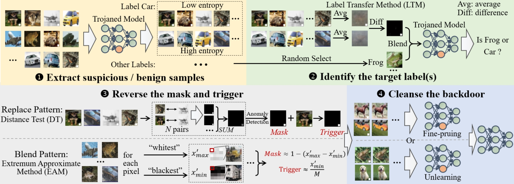

# ReBack
The official implementation of the paper "Need for Speed: Taming Backdoor Attacks with Speed and Precision" accepted by 45-th IEEE Symposium on Security and Privacy.

Modern deep neural network models (DNNs) require extensive data for optimal performance, prompting reliance on multiple entities for the acquisition of training datasets. 
One prominent security threat is backdoor attacks where the adversary party poisons a small subset of training datasets to implant a backdoor into the model, leading to misclassifications during runtime for triggered samples.
To mitigate the attack, many defense methods have been proposed, such as detecting and removing poisoned samples or rectifying trojaned model weights in victim DNNs.
However, existing approaches suffer from notable inefficiency as they are faced with large-scale training datasets, consequently rendering these defenses impractical in the real world. 

In this paper, we propose a lightweight backdoor identification and removal scheme, called ReBack.
In this scheme, ReBack first extracts a subset of suspicious and benign samples, and then, proceeds with a ``averaging and differencing'' based method to identify target label(s).
Next, leveraging the identification results, ReBack invokes a novel reverse engineering method to recover the exact trigger using only basic arithmetic atoms.
Our experiments demonstrate that, for ImageNet with 750 labels, ReBack can defend against backdoor attacks in around 2 hours, showcasing a speed improvement of $18.5\times$ to $214\times$ compared to existing methods. 
For backdoor removal, the attack success rate can be decreased to $0.05\%$ owing to $99\%$ cosine similarity of the reversed triggers.



****
We provide ReBack demos based on [repository Fight-Poison-With-Poison](https://github.com/Unispac/Fight-Poison-With-Poison) from @Unispac.

First, put "reback" file in folder "other_cleansers" and then, call it in file "other_cleanser.py" by:
```
from other_cleansers import reback
reback.main(args, model, poisoned_set, num_classes, K=100)
```
